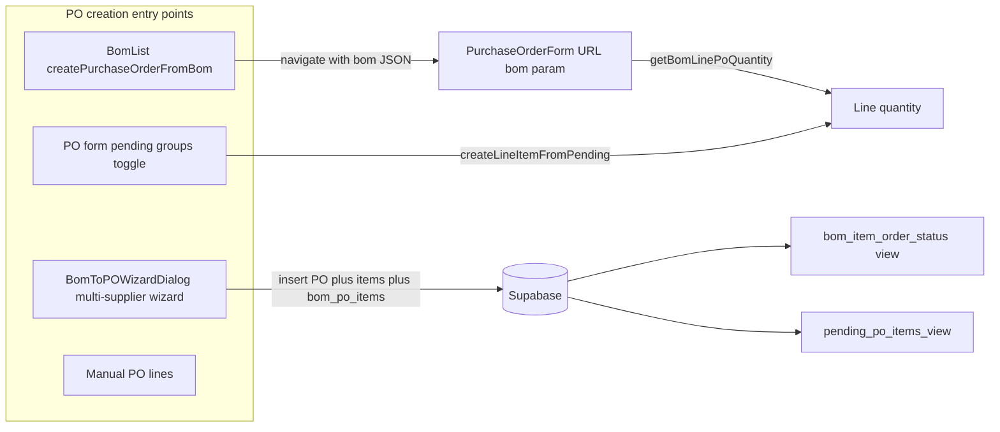

# Purchase order quantity mismatch vs BOM — investigation report

This document describes how BOM-driven purchase order quantities are produced in this codebase, summarizes the reported issue for sales order **TUC/26-27/APR/044**, ranks plausible root causes with references, and lists verification queries and fix options intended to avoid regressions elsewhere.

---

## 1. Issue summary (observed behavior)

**Sales order:** `TUC/26-27/APR/044` (multi-line / multi-product order).

**BOM baselines (from user screenshots):**

| BOM | Product | Key lines (BOM “Total required”) |
|-----|---------|----------------------------------|
| P1 (`…-P1`) | Reven Polo | Fabric **17.71 Kgs**; Collar & Cuff **62.00 set** |
| P2 (`…-P2`) | Navycut Hoodie | Fabric **13.75 Kgs**; Durby **2.86 kg** |

**Purchase orders (reported):**

| PO (example) | Line | BOM expectation | PO showed (reported) | Approx. relationship |
|--------------|------|-----------------|----------------------|----------------------|
| TUC/PO/0011 | Fabric (QRC Loopknit, Black 350 GSM) | 13.75 Kgs | **27.75 Kgs** | ~**2×** (13.75 × 2 = 27.5) |
| TUC/PO/0011 | Durby | 2.86 kg | **5.86 kg** | ~**2×** |
| TUC/PO/0014 | Fabric (OE Airtex, Black 240 GSM) | 17.71 Kgs | **37.71 Kgs** | +**20** vs BOM (not a clean double) |
| TUC/PO/0014 | Collar & Cuff | 62 set | **126.00 set** | ~**2×** (62 × 2 = 124; close to 126) |

**User expectation:** PO line default quantities should match BOM requirements (after stock allocation and existing PO coverage), until the user deliberately changes quantity on the PO.

---

## 2. Current implementation

### 2.1 High-level data flow



### 2.2 Entry points and responsibilities

| Path | What happens | Primary files |
|------|----------------|---------------|
| **BOM list → new PO** | Loads `bom_record_items`, builds `remainingForPoLine` per row using `inventory_allocations` and `getBomItemOrderStatus` (backed by `bom_item_order_status`), sets each row’s `to_order` to that remainder, JSON-encodes payload, navigates to `/procurement/po/new?bom=…`. | `src/components/purchase-orders/BomList.tsx` (`createPurchaseOrderFromBom`) |
| **Multi-supplier wizard** | Loads BOM rows, merges remaining math in dialog, user assigns suppliers and quantities, inserts `purchase_orders`, `purchase_order_items`, and `bom_po_items`. | `src/components/purchase-orders/BomToPOWizardDialog.tsx`, `BomToPOWizard.tsx`, `src/hooks/useBomPOWizard.ts`, `src/services/bomPOTracking.ts` |
| **PO form + pending panel** | Pending rows come from `pending_po_items_view` (or fallback query). Toggling a row/group adds `LineItem`s with `quantity` from `remaining_quantity` / `qty_total`. | `src/components/purchase-orders/PurchaseOrderForm.tsx`, `src/hooks/usePendingPoItems.ts` |
| **Manual lines** | No `bom_item_id`; quantities are user-entered. | `PurchaseOrderForm.tsx` |

### 2.3 How a line quantity is chosen from a BOM payload

`getBomLinePoQuantity` **always prefers an explicit `to_order`** on the payload (including `0`), otherwise falls back to `qty_total` / `quantity`:

```125:139:src/components/purchase-orders/bomOrderLineUtils.ts
export function getBomLinePoQuantity(item: Record<string, unknown> | null | undefined): number {
  if (!item || typeof item !== 'object') return 0;
  const raw = item['to_order'];
  const hasExplicit =
    raw !== undefined &&
    raw !== null &&
    raw !== '' &&
    !(typeof raw === 'number' && Number.isNaN(raw));
  if (hasExplicit) {
    const n = Number(raw);
    return Number.isFinite(n) ? Math.max(0, n) : 0;
  }
  const fallback = item['qty_total'] ?? item['quantity'];
  const n = Number(fallback);
  return Number.isFinite(n) ? Math.max(0, n) : 0;
}
```

The BOM-list path sets `to_order` to `remainingForPoLine(item)` before navigation, so the PO form typically uses **remainder**, not raw DB `to_order`, for that flow.

Remaining math helper:

```142:152:src/components/purchase-orders/bomOrderLineUtils.ts
export function remainingQtyForNewPurchaseOrderLine(params: {
  qtyTotal: number;
  inventoryAllocated: number;
  totalOrderedOnPurchaseOrders: number;
}): number {
  const q = Math.max(0, Number(params.qtyTotal) || 0);
  const a = Math.max(0, Number(params.inventoryAllocated) || 0);
  const p = Math.max(0, Number(params.totalOrderedOnPurchaseOrders) || 0);
  return Math.max(0, q - a - p);
}
```

### 2.4 PO form: loading BOM from URL

In `PurchaseOrderForm.tsx`, when `bomData` and master options are available, each BOM row becomes a line with:

- `quantity: getBomLinePoQuantity(item)`
- `bom_qty_total` from `qty_total` (or `quantity`)
- `bom_item_id` / `bom_id` from the row

So the **persisted** `bom_record_items.qty_total` and the **payload’s** `to_order` (when present) drive defaults.

### 2.5 Database: ordered vs required per BOM line

View `bom_item_order_status` (see `supabase/migrations/20250108000002_create_bom_po_tracking.sql`) joins `bom_record_items` to `bom_po_items` **only** and aggregates:

- `total_required` = `bri.qty_total`
- `total_ordered` = `SUM(bpi.ordered_quantity)`
- `remaining_quantity` = `qty_total - SUM(...)`

Because there is **no** join to `inventory_allocations` in this view, `SUM(bpi.ordered_quantity)` is **not** multiplied by allocation rows here.

### 2.6 Pending queue view: join fan-out risk

`pending_po_items_view` (see `supabase/migrations/20260404180000_pending_po_items_view_fabric_id.sql`) does:

```sql
FROM bom_record_items bri
...
LEFT JOIN bom_po_items bpi ON bpi.bom_item_id = bri.id
LEFT JOIN inventory_allocations ia ON ia.bom_item_id = bri.id
GROUP BY bri.id, ...
```

With **multiple** `inventory_allocations` rows per `bom_item_id`, each `bom_po_items` row is repeated in the join product before `GROUP BY`. Then:

- `SUM(bpi.ordered_quantity)` can **over-count** ordered quantity (each PO line counted once per allocation row).

That skews `total_ordered` and `remaining_quantity` in the **pending** pipeline, not in `bom_item_order_status` itself.

### 2.7 Pending UI grouping

`buildPendingItemGroups` in `src/hooks/usePendingPoItems.ts` aggregates **display** totals across BOMs when fabric identity (name / color / gsm) or item identity matches. Selecting a **group** still calls `handleGroupSelection`, which toggles **each** `bomBreakdowns` entry — one PO line per `bom_item_id` — so group selection alone does not merge two BOM lines into one `LineItem` by design.

### 2.8 Read-only / PDF display aggregation

`aggregatedSelectedItems` in `PurchaseOrderForm.tsx` (around the `useMemo` starting ~line 575) **groups** line items by a derived identity key:

- **Fabric:** supplier-facing name (or fabric name) + color + gsm + UOM
- **Item:** `item_id` or `item_name` + UOM

It **sums** `quantity` for all lines in the same group. If two distinct `LineItem`s share the same identity key, the UI shows **one** row with **combined** quantity — which can look like an “inflated” single line even when the underlying `items` array had two rows.

---

## 3. Root cause analysis (ranked hypotheses)

### Hypothesis A — Duplicate or merge-equivalent PO lines summed in display (high relevance for ~2× pattern)

**Mechanism:** If `items` contains two lines with the same `aggregatedSelectedItems` identity (e.g. two `bom_item_id`s resolved to the same fabric display key, or accidental duplicate lines), the **Selected Items** / read-only view shows **one** row whose quantity is the **sum**.

**Why it fits the screenshots:** P2 fabric **13.75 → ~27.75** and Durby **2.86 → ~5.86** are consistent with **doubling**. Collar **62 → ~126** is also ~2×.

**How to confirm:** Query `purchase_order_items` for each PO id: count rows and compare **raw** quantities per row vs aggregated UI. If two rows exist with ~13.75 each but UI shows one line ~27.75, this hypothesis is confirmed.

### Hypothesis B — Persisted `bom_record_items` out of sync with BOM screen (high relevance for non-2× cases)

**Mechanism:** The BOM detail UI may show values recalculated from `total_order_qty` and `qty_per_product`, while the PO uses **`qty_total` stored on `bom_record_items`** (and payload `to_order` derived from that `qty_total` in the list flow).

**Why it fits:** **37.71 vs 17.71** (+20) does not match a simple double. A wrong **`qty_per_product`** (e.g. pcs per kg) or stale `qty_total` in the database could produce a PO default that still “looks” like a valid number.

**How to confirm:** For the fabric line on PO TUC/PO/0014, load `bom_record_items.qty_total`, `qty_per_product`, and parent `bom_records.total_order_qty` and compare to the BOM screen formulas.

### Hypothesis C — `pending_po_items_view` fan-out (medium relevance; mostly pending / remaining)

**Mechanism:** As in §2.6, `SUM(bpi.ordered_quantity)` can inflate when multiple allocation rows exist.

**Effect:** More often **understates** remaining (overstates ordered), which can push users to different workflows or confuse “what’s left.” It is still a **real bug** to fix in the view for data correctness.

**How to confirm:** `COUNT(*)` from `inventory_allocations` grouped by `bom_item_id` for affected lines; if count > 1, inspect view output for `total_ordered`.

### Hypothesis D — Multiple creation paths and manual entry (context)

**Mechanism:** Wizard path uses **user-entered** assignment quantities; BOM list path uses computed remainder. Any manual edit on the PO form overrides defaults.

**How to confirm:** Record whether POs were created from **Create PO from BOM** (navigate with `?bom=`), **wizard**, or **pending** toggles, and whether quantities were edited before save.

---

## 4. Verification checklist (SQL and app-level)

Run in Supabase SQL (or your DB client), replacing placeholders.

### 4.1 Resolve order and BOMs

```sql
-- Order id and BOMs for TUC/26-27/APR/044
SELECT o.id AS order_id, o.order_number,
       br.id AS bom_id, br.bom_number, br.product_name, br.total_order_qty
FROM orders o
JOIN bom_records br ON br.order_id = o.id
WHERE o.order_number = 'TUC/26-27/APR/044';
```

### 4.2 BOM lines vs expected totals

```sql
-- All BOM lines for those BOMs
SELECT br.bom_number, bri.id AS bom_item_id, bri.item_name, bri.category,
       bri.qty_per_product, bri.qty_total, bri.to_order, bri.unit_of_measure
FROM bom_record_items bri
JOIN bom_records br ON br.id = bri.bom_id
WHERE br.order_id = (SELECT id FROM orders WHERE order_number = 'TUC/26-27/APR/044')
ORDER BY br.bom_number, bri.category, bri.item_name;
```

Check for **duplicate** rows (same product intent, two lines) or surprising `qty_total`.

### 4.3 PO lines and tracking

```sql
-- PO headers linked to those BOMs
SELECT po.id, po.po_number, po.bom_id, br.bom_number
FROM purchase_orders po
LEFT JOIN bom_records br ON br.id = po.bom_id
WHERE po.bom_id IN (
  SELECT id FROM bom_records WHERE order_id = (SELECT id FROM orders WHERE order_number = 'TUC/26-27/APR/044')
)
   OR po.id IN (
     SELECT DISTINCT po_id FROM bom_po_items
     WHERE bom_id IN (
       SELECT id FROM bom_records WHERE order_id = (SELECT id FROM orders WHERE order_number = 'TUC/26-27/APR/044')
     )
   );

-- Line items + BOM link
SELECT poi.id, po.po_number, poi.item_name, poi.quantity, poi.unit_of_measure,
       bpi.bom_item_id, bpi.ordered_quantity
FROM purchase_order_items poi
JOIN purchase_orders po ON po.id = poi.po_id
LEFT JOIN bom_po_items bpi ON bpi.po_item_id = poi.id
WHERE po.po_number IN ('TUC/PO/0011', 'TUC/PO/0014');  -- adjust to actual numbers
```

If **two** `purchase_order_items` rows tie to different `bom_item_id`s but correspond to the same displayed fabric (after supplier name resolution), cross-check with §2.8 aggregation.

### 4.4 Allocations per BOM line (pending view fan-out)

```sql
SELECT bom_item_id, COUNT(*) AS allocation_rows, SUM(quantity) AS total_allocated
FROM inventory_allocations
WHERE bom_item_id IN (
  SELECT bri.id FROM bom_record_items bri
  JOIN bom_records br ON br.id = bri.bom_id
  WHERE br.order_id = (SELECT id FROM orders WHERE order_number = 'TUC/26-27/APR/044')
)
GROUP BY bom_item_id
HAVING COUNT(*) > 1;
```

### 4.5 Compare `bom_item_order_status` vs `pending_po_items_view` for a single line

```sql
SELECT * FROM bom_item_order_status WHERE bom_item_id = '<bom_item_uuid>';
SELECT * FROM pending_po_items_view WHERE bom_item_id = '<bom_item_uuid>';
```

Discrepancies in `total_ordered` / `remaining_quantity` with multiple allocation rows support Hypothesis C.

---

## 5. Recommended solutions (trade-offs)

| Direction | What to do | Pros | Risks / notes |
|-----------|------------|------|----------------|
| **A. Aggregation key** | Include `bom_item_id` in `aggregatedSelectedItems` identity when present so **distinct BOM lines never merge**; only merge lines without `bom_item_id`. | Stops false “inflated” single lines in read-only/PDF when two BOM lines share the same fabric display attributes. | More rows in print/UI when the same fabric appears on two BOMs intentionally. |
| **B. Diagnostics** | In read-only PO view, show per–`bom_item_id` breakdown (table or expandable) next to aggregated totals. | Faster confirmation of Hypothesis A without raw SQL. | Slight UI complexity. |
| **C. SQL fix** | Rewrite `pending_po_items_view` so `SUM(bpi.ordered_quantity)` and `SUM(ia.quantity)` come from **subqueries** or CTEs aggregated **per `bom_item_id`** before joining to `bri`. | Correct pending totals under multi-row allocations. | Requires migration + regression check on RLS/consumers. |
| **D. Single source of truth** | For every automated path, default quantity = `remainingQtyForNewPurchaseOrderLine` using **`bom_item_order_status` + allocations**, and avoid trusting raw `bom_record_items.to_order` from DB when not recomputed. | Consistent defaults across wizard vs form if applied everywhere. | Touches multiple flows; needs careful testing. |

Implement **A** and **C** first if verification confirms merged display (A) and/or allocation fan-out (C). Use **B** temporarily if you need production visibility before code changes.

---

## 6. Summary

- The codebase has **several** PO creation paths; default quantities ultimately depend on **`bom_record_items.qty_total`**, optional payload **`to_order`**, **`inventory_allocations`**, and **`bom_po_items`** aggregates.
- The reported **~2×** pattern strongly suggests either **two underlying PO lines** merged by **`aggregatedSelectedItems`**, or **duplicate BOM lines** feeding the same identity — verify with raw `purchase_order_items` and `bom_record_items` counts.
- The **+20** fabric discrepancy points to **persisted BOM math / qty fields** differing from what the BOM UI displays — verify DB columns vs on-screen calculation.
- **`pending_po_items_view`** has a **known SQL fan-out risk** when multiple allocation rows exist; fix with pre-aggregated subqueries to avoid double-counting `ordered_quantity`.

---

## 7. Implementation status

The following items from §5 are **implemented** in this repository:

- **A (aggregation key):** `PurchaseOrderForm` `aggregatedSelectedItems` now uses a per-line key `bom_item|<bom_item_id>` when `bom_item_id` is set, so BOM-backed lines are never merged by fabric/item identity. Manual lines (no `bom_item_id`) still aggregate by fabric or item identity as before.
- **C (pending view fan-out):** Migration `supabase/migrations/20260409120000_pending_po_items_view_fix_join_fanout.sql` recreates `pending_po_items_view` using pre-aggregated `bom_po_items` and `inventory_allocations` subqueries joined by `bom_item_id`, removing the Cartesian product on `SUM(bpi.ordered_quantity)`.

**Deploy:** Run pending Supabase migrations against your database (e.g. `supabase db push` or your CI migration step) so the view update applies.

**Not implemented (optional):** §5 **B** (extra diagnostics UI) and **D** (unify all PO default-qty paths) — follow up if still needed after verifying BOM vs DB `qty_total` for non-2× cases.

---

*Document generated from codebase review. Update this file with actual UUIDs and PO numbers once verified in your environment.*
