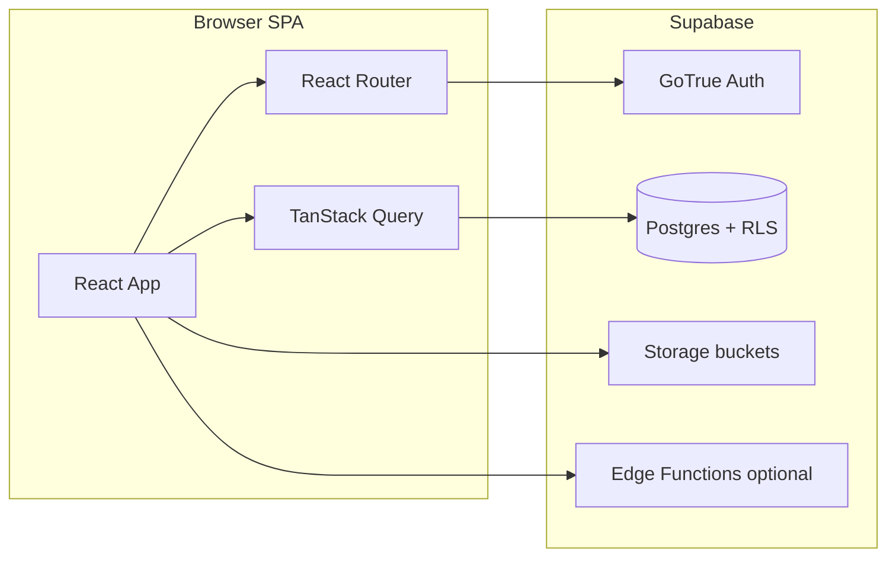

# Fabric Flow ERP India — Project Handbook

This document describes the **fabric-flow-erp-india** codebase: product intent, architecture, routes, functional modules, order-fulfillment concepts, data access patterns, and Supabase backend themes. It is meant for engineers, stakeholders, or partners who need a **single orientation** before diving into the repository.

**Maintainers:** Re-verify details against the files listed in [Source of truth](#source-of-truth) after major changes.

---

## 1. Product summary

**Fabric Flow ERP India** is a web-based **ERP for apparel / fabric operations**: customer and lead management, sales orders (especially custom orders), quotations and invoicing, design and printing stages, bills of materials (BOM), purchase orders (PO) and goods receipt notes (GRN), warehouse inventory, production assignment (cutting, tailors, picking), quality checks, dispatch, people (HR-style master data), configurable company branding, reports, and in-app tutorials.

**Typical users:**

- **Internal staff** — sales, procurement, warehouse, production floor, QC, dispatch, accounts.
- **Administrators** — company configuration, employee and customer portal access, sidebar permissions.
- **Customer portal** — authenticated customers can use the dedicated customer dashboard (`/customer`) when enabled.

The historical database name in early migrations is **“Scissors ERP”**; the application today is the same product lineage under the Fabric Flow branding.

---

## 2. Technology stack

Defined primarily by [`package.json`](/Users/mukeshayudh/Projects/fabric-flow-erp-india/package.json):

| Area | Technology |
|------|------------|
| UI | React 18, TypeScript |
| Build / dev server | Vite 7 |
| Routing | React Router 6 |
| Server state / caching | TanStack Query (`@tanstack/react-query`) |
| Backend-as-a-service | Supabase (`@supabase/supabase-js`) — Auth, Postgres, Row Level Security, Storage |
| Forms / validation | react-hook-form, Zod, `@hookform/resolvers` |
| Styling | Tailwind CSS, tailwind-merge, tailwindcss-animate |
| Components | Radix UI primitives, shadcn-style wrappers under `src/components/ui/` |
| Charts | Recharts |
| Documents / export | jspdf, html2canvas, xlsx, papaparse |
| Barcodes | jsbarcode |
| Theming | next-themes |
| Other | date-fns, cmdk, embla-carousel, three.js stack (used where 3D/visualizations exist), PWA install prompt |

**Scripts:** `npm run dev`, `npm run build`, `npm run lint`, `npm run test:roles`, `npm run test:fulfillment`, `npm run preview`.

---

## 3. Runtime architecture



- The **SPA** talks to Supabase using the client in [`src/integrations/supabase/client.ts`](/Users/mukeshayudh/Projects/fabric-flow-erp-india/src/integrations/supabase/client.ts).
- **Schema types** for tables and RPCs are generated / maintained in [`src/integrations/supabase/types.ts`](/Users/mukeshayudh/Projects/fabric-flow-erp-india/src/integrations/supabase/types.ts).
- **SQL migrations** under [`supabase/migrations/`](/Users/mukeshayudh/Projects/fabric-flow-erp-india/supabase/migrations/) are the authoritative source for tables, triggers, policies, and database functions.
- **Edge Functions** exist under [`supabase/functions/`](/Users/mukeshayudh/Projects/fabric-flow-erp-india/supabase/functions/) (for example a keep-alive style function); the bulk of business logic for orders and inventory still lives in **Postgres** (triggers + functions) and the **React** layer.

---

## 4. Application bootstrap

[`src/App.tsx`](/Users/mukeshayudh/Projects/fabric-flow-erp-india/src/App.tsx) composes the global tree:

1. **`QueryClientProvider`** — React Query; note `refetchOnWindowFocus: false` to avoid resetting long forms when switching tabs.
2. **`ThemeProvider`** (`next-themes`) — light/dark/system.
3. **`AuthProvider`** — session and profile; see [Auth, roles, and access](#11-auth-roles-and-access).
4. **`AppCacheProvider`**, **`FormPersistenceProvider`**, **`GlobalFormPersistenceProvider`** — caching and form persistence across navigation.
5. **`TooltipProvider`**, **Toaster** (shadcn), **Sonner** — global UI feedback.
6. **`BrowserRouter`** + **`Routes`** — all routes listed in [Routing catalog](#5-routing-catalog).
7. **`PWAInstallPrompt`** — optional install prompt for supported browsers.

**Protected shell:**

- Most routes wrap children in **`ProtectedRouteWithCompanySettings`**, which nests **`CompanySettingsProvider`** (company config, favicon, etc.), then [`ProtectedRoute`](/Users/mukeshayudh/Projects/fabric-flow-erp-india/src/components/auth/ProtectedRoute.tsx).
- **`/configuration`** and several **`/admin/*`** routes pass **`requiredRole={['admin']}`** so only admin profiles (or the pre-configured admin email path in `ProtectedRoute`) may access them.

**Startup behavior:** On first mount, `App` runs **`syncSidebarUrls()`**, which attempts to align `sidebar_items` rows in Supabase with a hard-coded list of titles/URLs/icons for top-level menu items (see `syncSidebarUrls` in `App.tsx`). This keeps DB-driven navigation in sync with the app’s canonical routes.

**Root path `/`:** Renders **`PermissionAwareRedirect`**, which sends users to an appropriate first screen (often `/dashboard`) based on admin detection and sidebar permissions (see [Navigation vs routes](#6-navigation-vs-routes)).

---

## 5. Routing catalog

All routes are declared in [`src/App.tsx`](/Users/mukeshayudh/Projects/fabric-flow-erp-india/src/App.tsx). Component names below match the imported page or layout wrapper.

### Public

| Path | Component |
|------|-----------|
| `/login` | `LoginForm` |
| `/signup` | `SignupForm` |

### Protected (alphabetically by path prefix)

| Path | Component | Notes |
|------|-----------|--------|
| `/` | `PermissionAwareRedirect` | Not a traditional “home page”; redirects. |
| `/accounts/invoices` | `InvoicePage` | |
| `/accounts/invoices/:id` | `InvoiceDetailPage` | |
| `/accounts/manual-quotations/new` | `ManualQuotationFormPage` | |
| `/accounts/manual-quotations/:id` | `ManualQuotationDetailPage` | |
| `/accounts/manual-quotations/:id/edit` | `ManualQuotationFormPage` | |
| `/accounts/quotations` | `QuotationsPage` | |
| `/accounts/quotations/:id` | `QuotationDetailPage` | |
| `/accounts/receipts` | `ReceiptPage` | |
| `/accounts/receivables` | `ReceivablesPage` | |
| `/admin/customer-access` | `CustomerAccessManagement` | **admin** role |
| `/admin/employee-access` | `EmployeeAccessManagementPage` | **admin** role |
| `/admin/users` | `UserManagement` | **admin** role |
| `/analytics` | `AnalyticsPage` | |
| `/bom` | `BomListPage` | |
| `/bom/create` | `ErpLayout` + `BomCreator` | |
| `/bom/new` | `BomForm` | |
| `/bom/:id` | `BomForm` | |
| `/bom/:id/edit` | `BomForm` | |
| `/configuration` | `CompanyConfigPage` | **admin** role |
| `/crm` | `CrmPage` | |
| `/crm/customers` | `CustomersPage` | |
| `/crm/customers/:id` | `CustomerDetailPage` | |
| `/crm/leads` | `LeadsPage` | |
| `/crm/leads/:id` | `LeadDetailPage` | |
| `/customer` | `CustomerDashboard` | Customer-facing experience |
| `/dashboard` | `Index` | Main dashboard |
| `/design` | `Navigate` → `/design/designs` | |
| `/design/designs` | `DesignDesignsPage` | |
| `/design/printing` | `DesignPrintingPage` | |
| `/dispatch` | `DispatchPage` | |
| `/dispatch/challan/:id` | `DispatchChallanPrint` | Print-oriented view |
| `/inventory` | `InventoryPage` | Legacy / hub inventory page |
| `/inventory/adjustment` | `InventoryAdjustmentPage` | |
| `/inventory/fabrics` | `ErpLayout` + `FabricManagerNew` | Fabric master UI |
| `/inventory/product-categories` | `ProductCategoriesPage` | |
| `/inventory/products` | `Navigate` → `/warehouse/inventory?tab=product` | |
| `/inventory/size-types` | `SizeTypesPage` | |
| `/masters` | `MastersPage` | Masters hub |
| `/masters/branding-types` | `BrandingTypePage` | |
| `/masters/colors` | `ColorMasterPage` | |
| `/masters/customer-types` | `CustomerTypeMasterPage` | |
| `/masters/images` | `ImageMasterPage` | |
| `/masters/items` | `ItemMasterPage` | |
| `/masters/product-parts` | `ProductPartsManager` | |
| `/masters/products` | `ProductMasterPage` | |
| `/masters/suppliers` | `SupplierMasterPage` | |
| `/masters/warehouses` | `WarehouseMasterPage` | |
| `/orders` | `OrdersPage` | Custom orders list |
| `/orders/:id` | `OrderDetailPage` | |
| `/orders/:id/assign-batches` | `OrderBatchAssignmentPage` | |
| `/orders/readymade` | `ReadymadeOrdersPage` | Routed; may be hidden from sidebar |
| `/people` | `PeoplePage` | |
| `/people/departments` | `DepartmentsPage` | |
| `/people/departments/:id` | `DepartmentDetailPage` | |
| `/people/designations` | `DesignationsPage` | |
| `/people/employees` | `EmployeesPage` | |
| `/people/employees/:id` | `EmployeeDetailPage` | |
| `/people/production-team` | `ProductionTeamPage` | |
| `/people/production-team/:id` | `ProductionTeamDetailPage` | |
| `/procurement` | `ProcurementPage` | |
| `/procurement/grn` | `ErpLayout` + `GRNList` | |
| `/procurement/grn/new` | `ErpLayout` + `GRNForm` | |
| `/procurement/grn/:id` | `ErpLayout` + `GRNForm` | |
| `/procurement/order-flow-assignment` | `OrderFlowAssignmentPage` | |
| `/procurement/po` | `PurchaseOrderListPage` | |
| `/procurement/po/new` | `PurchaseOrderFormPage` | |
| `/procurement/po/:id` | `PurchaseOrderFormPage` | |
| `/production` | `ProductionPage` | |
| `/production/assign-orders` | `AssignOrdersPage` | |
| `/production/cutting-manager` | `CuttingManagerPage` | |
| `/production/order-completion-report` | `OrderCompletionReportPage` | |
| `/production/picker` | `PickerPage` | Under “Quality” in sidebar grouping |
| `/production/tailor-management` | `TailorManagementPage` | |
| `/profile` | `ProfileSettingsPage` | |
| `/quality` | `QualityPage` | |
| `/quality/checks` | `QCPage` | |
| `/quality/dispatch` | `DispatchQCPage` | |
| `/reports` | `ErpLayout` + `ReportsPage` | |
| `/settings` | `SettingsPage` | |
| `/stock-orders` | `StockOrdersPage` | Routed; sidebar link may be commented |
| `/tutorials` | `ErpLayout` + `TutorialsPage` | |
| `/warehouse/inventory` | `InventoryDashboardPage` | Primary warehouse inventory dashboard |
| `*` | `NotFound` | Catch-all |

---

## 6. Navigation vs routes

**Static sidebar definition:** [`src/components/ErpSidebar.tsx`](/Users/mukeshayudh/Projects/fabric-flow-erp-india/src/components/ErpSidebar.tsx) builds a default tree in `buildSidebarItems()` (Dashboard, CRM, Orders, Accounts, Design & Printing, Procurement, Inventory, Production, Quality Check, People, Masters, User & Roles, Reports, Configuration, Tutorials).

**Database-driven visibility:** [`src/hooks/useSidebarPermissions.ts`](/Users/mukeshayudh/Projects/fabric-flow-erp-india/src/hooks/useSidebarPermissions.ts) loads **`sidebar_items`** (and related permission data) from Supabase so admins can control which menus a user sees. **`mergeMissingStaticChildren`** merges static sidebar children into the dynamic tree when new routes exist before DB rows catch up.

**Important discrepancies to be aware of:**

- **Readymade** and **stock orders** routes exist in the router (`/orders/readymade`, `/stock-orders`) but links in `ErpSidebar` may be **commented out** when those flows are not ready for general use.
- **Order completion report** (`/production/order-completion-report`) exists in the router but may be commented out in the sidebar.
- **People → Production team** routes exist (`/people/production-team`, `.../:id`) but sidebar entries may be commented out.
- **Quality Check** in the sidebar groups **Picker** under `/production/picker` (production path prefix, not `/quality/...`).

---

## 7. Functional modules

Below: **purpose**, **routes**, **primary pages** (`src/pages/`), and **key components** (`src/components/`). This is not an exhaustive file list; it highlights where most UI logic lives.

### 7.1 CRM

- **Purpose:** Manage customers and sales leads; drill into detail records.
- **Routes:** `/crm`, `/crm/customers`, `/crm/customers/:id`, `/crm/leads`, `/crm/leads/:id`.
- **Pages:** [`src/pages/crm/`](/Users/mukeshayudh/Projects/fabric-flow-erp-india/src/pages/crm/), [`CrmPage.tsx`](/Users/mukeshayudh/Projects/fabric-flow-erp-india/src/pages/CrmPage.tsx).
- **Components:** [`customers/`](/Users/mukeshayudh/Projects/fabric-flow-erp-india/src/components/customers/) (forms, lists, search selects).

### 7.2 Orders

- **Purpose:** Create and track **custom** sales orders; open order detail; assign fabric / production batches where applicable.
- **Routes:** `/orders`, `/orders/:id`, `/orders/:id/assign-batches`, plus `/orders/readymade`, `/stock-orders` when enabled.
- **Pages:** [`OrdersPage.tsx`](/Users/mukeshayudh/Projects/fabric-flow-erp-india/src/pages/OrdersPage.tsx), [`orders/OrderDetailPage.tsx`](/Users/mukeshayudh/Projects/fabric-flow-erp-india/src/pages/orders/OrderDetailPage.tsx), [`orders/OrderBatchAssignmentPage.tsx`](/Users/mukeshayudh/Projects/fabric-flow-erp-india/src/pages/orders/OrderBatchAssignmentPage.tsx), readymade/stock pages under [`src/pages/orders/`](/Users/mukeshayudh/Projects/fabric-flow-erp-india/src/pages/orders/).
- **Components:** [`orders/`](/Users/mukeshayudh/Projects/fabric-flow-erp-india/src/components/orders/) (`OrderForm`, customization modals, branding placement, etc.), production dialogs such as [`BatchAssignmentPreviewDialog.tsx`](/Users/mukeshayudh/Projects/fabric-flow-erp-india/src/components/production/BatchAssignmentPreviewDialog.tsx).

### 7.3 Accounts (finance)

- **Purpose:** Quotations (from orders and manual), invoices, receipts, receivables.
- **Routes:** `/accounts/quotations`, `.../:id`, manual quotation CRUD under `/accounts/manual-quotations/*`, `/accounts/invoices`, `.../:id`, `/accounts/receipts`, `/accounts/receivables`.
- **Pages:** [`src/pages/accounts/`](/Users/mukeshayudh/Projects/fabric-flow-erp-india/src/pages/accounts/).
- **Components:** [`invoices/`](/Users/mukeshayudh/Projects/fabric-flow-erp-india/src/components/invoices/), [`accounts/`](/Users/mukeshayudh/Projects/fabric-flow-erp-india/src/components/accounts/) (print helpers, line summaries).

### 7.4 Design and printing

- **Purpose:** Track design assets and printing workstreams (stage varies by company process).
- **Routes:** `/design/designs`, `/design/printing`, redirect from `/design`.
- **Pages:** [`DesignDesignsPage.tsx`](/Users/mukeshayudh/Projects/fabric-flow-erp-india/src/pages/DesignDesignsPage.tsx), [`DesignPrintingPage.tsx`](/Users/mukeshayudh/Projects/fabric-flow-erp-india/src/pages/DesignPrintingPage.tsx).
- **Components:** Design-related UI may also use shared order/design utilities such as [`src/lib/designOrderStage.ts`](/Users/mukeshayudh/Projects/fabric-flow-erp-india/src/lib/designOrderStage.ts).

### 7.5 Procurement

- **Purpose:** Assign per-line **execution flow** (stitching / outsource / inventory), maintain **BOMs**, raise **purchase orders**, record **GRN** receipts against POs.
- **Routes:** `/procurement`, `/procurement/order-flow-assignment`, `/procurement/po`, `/procurement/po/new`, `/procurement/po/:id`, `/procurement/grn`, `/procurement/grn/new`, `/procurement/grn/:id`, plus `/bom` subtree.
- **Pages:** [`src/pages/procurement/`](/Users/mukeshayudh/Projects/fabric-flow-erp-india/src/pages/procurement/).
- **Components:** [`purchase-orders/`](/Users/mukeshayudh/Projects/fabric-flow-erp-india/src/components/purchase-orders/) (`BomForm`, `BomCreator`, `PurchaseOrderForm`, wizards, allocation dialogs), [`goods-receipt-notes/`](/Users/mukeshayudh/Projects/fabric-flow-erp-india/src/components/goods-receipt-notes/) (`GRNList`, `GRNForm`, print/export).

### 7.6 Inventory and warehouse

- **Purpose:** Fabric and product catalog support, warehouse bins/racks/floors, stock levels, transfers, logs, and **inventory adjustments**.
- **Routes:** `/inventory/*`, `/warehouse/inventory` (main dashboard with tabs, including product inventory redirect).
- **Pages:** [`src/pages/inventory/`](/Users/mukeshayudh/Projects/fabric-flow-erp-india/src/pages/inventory/). The warehouse grid is largely [`WarehouseInventoryPage.tsx`](/Users/mukeshayudh/Projects/fabric-flow-erp-india/src/pages/warehouse/WarehouseInventoryPage.tsx), **embedded** inside [`InventoryDashboardPage.tsx`](/Users/mukeshayudh/Projects/fabric-flow-erp-india/src/pages/inventory/InventoryDashboardPage.tsx) for the raw-material tab (not a separate top-level route in `App.tsx`).
- **Components:** [`inventory/`](/Users/mukeshayudh/Projects/fabric-flow-erp-india/src/components/inventory/), [`warehouse/`](/Users/mukeshayudh/Projects/fabric-flow-erp-india/src/components/warehouse/) (grid/tree views, zones, modals, transfer dialogs), [`masters/InventoryAdjustment.tsx`](/Users/mukeshayudh/Projects/fabric-flow-erp-india/src/components/masters/InventoryAdjustment.tsx) with adjustment page.

### 7.7 Production

- **Purpose:** Operational dashboards, assigning work to production, cutting operations, tailor management, batch dialogs, picking quantities.
- **Routes:** `/production`, `/production/assign-orders`, `/production/cutting-manager`, `/production/tailor-management`, `/production/order-completion-report`, `/production/picker`.
- **Pages:** [`ProductionPage.tsx`](/Users/mukeshayudh/Projects/fabric-flow-erp-india/src/pages/ProductionPage.tsx), [`src/pages/production/`](/Users/mukeshayudh/Projects/fabric-flow-erp-india/src/pages/production/).
- **Components:** [`production/`](/Users/mukeshayudh/Projects/fabric-flow-erp-india/src/components/production/) (batch assignment, fabric picking, cutting dialogs, picker dialogs).

### 7.8 Quality and dispatch

- **Purpose:** QC checkpoints, dispatch QC, dispatch list, printable dispatch challan.
- **Routes:** `/quality`, `/quality/checks`, `/quality/dispatch`, `/dispatch`, `/dispatch/challan/:id`.
- **Pages:** [`QualityPage.tsx`](/Users/mukeshayudh/Projects/fabric-flow-erp-india/src/pages/QualityPage.tsx), [`src/pages/quality/`](/Users/mukeshayudh/Projects/fabric-flow-erp-india/src/pages/quality/), [`DispatchPage.tsx`](/Users/mukeshayudh/Projects/fabric-flow-erp-india/src/pages/DispatchPage.tsx), [`DispatchChallanPrint.tsx`](/Users/mukeshayudh/Projects/fabric-flow-erp-india/src/pages/DispatchChallanPrint.tsx).
- **Components:** [`quality/`](/Users/mukeshayudh/Projects/fabric-flow-erp-india/src/components/quality/) (e.g. review dialogs).

### 7.9 People (HR-style)

- **Purpose:** Employees, departments, designations, production teams.
- **Routes:** `/people`, `/people/employees`, `.../:id`, `/people/departments`, `.../:id`, `/people/designations`, `/people/production-team`, `.../:id`.
- **Pages:** [`PeoplePage.tsx`](/Users/mukeshayudh/Projects/fabric-flow-erp-india/src/pages/PeoplePage.tsx), [`src/pages/people/`](/Users/mukeshayudh/Projects/fabric-flow-erp-india/src/pages/people/).
- **Components:** [`people/`](/Users/mukeshayudh/Projects/fabric-flow-erp-india/src/components/people/).

### 7.10 Masters

- **Purpose:** Long-lived reference data: products, items, warehouses, suppliers, colors, branding types, product parts, images, customer types.
- **Routes:** `/masters` and `/masters/*` (see routing table).
- **Pages:** [`src/pages/masters/`](/Users/mukeshayudh/Projects/fabric-flow-erp-india/src/pages/masters/).
- **Components:** [`masters/`](/Users/mukeshayudh/Projects/fabric-flow-erp-india/src/components/masters/).

### 7.11 Administration and configuration

- **Purpose:** Company-wide settings (branding, GST, behavior flags), user/employee/customer access for portal and roles.
- **Routes:** `/configuration` (admin), `/admin/users`, `/admin/customer-access`, `/admin/employee-access`.
- **Pages:** [`CompanyConfigPage.tsx`](/Users/mukeshayudh/Projects/fabric-flow-erp-india/src/pages/admin/CompanyConfigPage.tsx), [`CustomerAccessManagement.tsx`](/Users/mukeshayudh/Projects/fabric-flow-erp-india/src/pages/admin/CustomerAccessManagement.tsx), [`EmployeeAccessManagement.tsx`](/Users/mukeshayudh/Projects/fabric-flow-erp-india/src/pages/admin/EmployeeAccessManagement.tsx) (page import is `EmployeeAccessManagementPage` from admin folder — see `App.tsx`).
- **Components:** [`admin/UserManagement.tsx`](/Users/mukeshayudh/Projects/fabric-flow-erp-india/src/components/admin/UserManagement.tsx), admin employee access UI under [`components/admin/`](/Users/mukeshayudh/Projects/fabric-flow-erp-india/src/components/admin/).

### 7.12 Dashboard, analytics, reports, settings, tutorials

- **Dashboard:** `/dashboard` → [`Index.tsx`](/Users/mukeshayudh/Projects/fabric-flow-erp-india/src/pages/Index.tsx); supporting [`Dashboard.tsx`](/Users/mukeshayudh/Projects/fabric-flow-erp-india/src/components/Dashboard.tsx), enhanced/cached variants, charts/table views.
- **Analytics:** `/analytics` → [`AnalyticsPage.tsx`](/Users/mukeshayudh/Projects/fabric-flow-erp-india/src/pages/AnalyticsPage.tsx).
- **Reports:** `/reports` → [`ReportsPage.tsx`](/Users/mukeshayudh/Projects/fabric-flow-erp-india/src/pages/reports/ReportsPage.tsx) inside `ErpLayout`.
- **Settings:** `/settings` → [`SettingsPage.tsx`](/Users/mukeshayudh/Projects/fabric-flow-erp-india/src/pages/SettingsPage.tsx).
- **Tutorials:** `/tutorials` → [`TutorialsPage.tsx`](/Users/mukeshayudh/Projects/fabric-flow-erp-india/src/pages/TutorialsPage.tsx) with [`tutorials/`](/Users/mukeshayudh/Projects/fabric-flow-erp-india/src/components/tutorials/) components and admin tutorial manager.

### 7.13 Customer portal and profile

- **Customer dashboard:** `/customer` → [`CustomerDashboard.tsx`](/Users/mukeshayudh/Projects/fabric-flow-erp-india/src/pages/customer/CustomerDashboard.tsx).
- **User profile:** `/profile` → [`ProfileSettingsPage.tsx`](/Users/mukeshayudh/Projects/fabric-flow-erp-india/src/pages/profile/ProfileSettingsPage.tsx).

### 7.14 Cross-cutting UX

- **Layout:** [`ErpLayout.tsx`](/Users/mukeshayudh/Projects/fabric-flow-erp-india/src/components/ErpLayout.tsx) wraps many pages for consistent chrome (sidebar, header).
- **Sidebar:** [`ErpSidebar.tsx`](/Users/mukeshayudh/Projects/fabric-flow-erp-india/src/components/ErpSidebar.tsx).
- **Global search:** [`UniversalSearchBar.tsx`](/Users/mukeshayudh/Projects/fabric-flow-erp-india/src/components/UniversalSearchBar.tsx) (orders, quotations, etc. depending on implementation).
- **Chat:** [`chat/`](/Users/mukeshayudh/Projects/fabric-flow-erp-india/src/components/chat/) — floating button, messages, mentions tied to orders/users.
- **Notifications:** [`notifications/`](/Users/mukeshayudh/Projects/fabric-flow-erp-india/src/components/notifications/).

---

## 8. Order fulfillment domain (application-level)

Type definitions live in [`src/domain/fulfillment/types.ts`](/Users/mukeshayudh/Projects/fabric-flow-erp-india/src/domain/fulfillment/types.ts):

- **`ExecutionFlow`:** `stitching` | `outsource` | `inventory` — how a sales order line is meant to be fulfilled.
- **`FulfillmentStatus`:** e.g. `pending_flow`, `flow_assigned`, `awaiting_procurement`, `awaiting_production`, `awaiting_dispatch_prep`, `ready_for_dispatch`, `dispatched`, `cancelled`.

[`src/domain/fulfillment/policy.ts`](/Users/mukeshayudh/Projects/fabric-flow-erp-india/src/domain/fulfillment/policy.ts) exposes human-readable **“next step”** hints for UI (for example: stitching + `flow_assigned` → create BOM and raise PO).

[`src/domain/fulfillment/transitions.ts`](/Users/mukeshayudh/Projects/fabric-flow-erp-india/src/domain/fulfillment/transitions.ts) mirrors important rules for the client:

- **`bomAllowedForLine`** — BOM creation is only considered allowed when the line is on the **stitching** path and not still in `pending_flow`; **outsource** and **inventory** flows do not allow BOM in this client-side check (the database may still enforce stricter rules via triggers — see migrations such as `20260506121500_fulfillment_module_gates.sql`).

**End-to-end story (simplified):**

1. Order and order lines are created in **Orders**.
2. **Procurement → Order flow assignment** (and/or DB RPC `assign_order_item_flows`) sets each line’s **execution flow** and fulfillment state.
3. **Stitching** lines typically drive **BOM → PO → GRN** and then **production** (cutting, tailors, picker).
4. **Outsource** lines emphasize **PO linked to the sales line** rather than internal stitching BOM (policy text in `FulfillmentPolicy`).
5. **Inventory** lines emphasize **stock reservation / readiness** for dispatch.
6. **QC and dispatch** complete the path to **accounts** (invoice, receipt, receivables).

Node tests under [`tests/order-fulfillment-policy.test.mjs`](/Users/mukeshayudh/Projects/fabric-flow-erp-india/tests/order-fulfillment-policy.test.mjs) validate parts of this policy surface.

---

## 9. Data and services layer (frontend)

The largest aggregation of Supabase reads/writes for dashboards and operational pages is **[`src/lib/database.ts`](/Users/mukeshayudh/Projects/fabric-flow-erp-india/src/lib/database.ts)** — customers, orders, dashboard summaries, pending order counts, production and QC snapshots, and many more table-specific helpers.

Other **`src/lib`** modules (each focused):

| File | Role |
|------|------|
| `auth.ts` | Auth helpers |
| `customerContact.ts` | Customer contact utilities |
| `designOrderStage.ts` | Design-stage helpers for orders |
| `employeesSchemaCompat.ts` | Employee / schema compatibility |
| `excelExport.ts` | Spreadsheet export |
| `grnColorSwatch.ts` | GRN display helpers |
| `perf.ts` | Performance helpers |
| `roleAccessGuards.ts` | Client-side role checks |
| `seedData.ts` | Seeding utilities (dev/setup) |
| `supplierUtils.ts` | Supplier-related helpers |
| `supabaseSoftDeleteCompat.ts` | Queries compatible with soft-delete columns |
| `testDatabase.ts` | Test-oriented DB helpers |
| `utils.ts` | Shared `cn()` and general utilities |

**Hooks** under `src/hooks/` implement reusable data and UI state (company settings, sidebar permissions, cached data, form helpers, etc.).

---

## 10. Backend / database (Supabase themes)

Migrations evolve the schema over time. Themes reflected across [`supabase/migrations/`](/Users/mukeshayudh/Projects/fabric-flow-erp-india/supabase/migrations/):

| Theme | Examples / notes |
|--------|-------------------|
| Core commercial | `customers`, `orders`, `order_items`, quotations, invoices, receipts, receivables; numbering functions (`generate_order_number`, `generate_po_number`, `generate_grn_number`, `generate_invoice_number`, `generate_quotation_number`, `generate_receipt_number`) in early complete-schema migrations |
| Product / fabric | `product_master`, `fabrics` / `fabric_master`, variants, images, color masters |
| Warehouse | Floors, racks, bins, `warehouse_inventory`, receiving zones, triggers on GRN approval to insert inventory (`trg_grn_approved_insert_inventory` and follow-ups) |
| Procurement | BOM tables, purchase orders, PO lines, GRN headers/lines, auto-complete PO when GRN approved |
| Production | Cutting assignments, order assignments, fabric picking records, production team |
| Order status | `recalc_order_status(order_id)` and triggers on receipts, order items, BOM records, cutting assignments, dispatch items — see `20251001121500_auto_status_updates.sql` and later fulfillment-aware versions (`20260506121000_recalc_order_status_fulfillment.sql`, `20260507220000_harden_order_numbering.sql`) |
| Fulfillment gates | Triggers such as `trg_enforce_bom_execution_flow`, `trg_enforce_po_item_execution_flow`, `trg_enforce_dispatch_order_item_flow` (`20260506121500_fulfillment_module_gates.sql`) |
| Flow assignment | RPC **`assign_order_item_flows`**, company settings flags requiring flow assignment before receipts finalize (`20260506120500_assign_order_item_flows_rpc.sql`, `20260507140000_ensure_company_settings_require_order_flow_assignment.sql`) |
| Fabric consumption | RPC **`consume_fabric_for_cutting`** (`20260501022000_add_consume_fabric_for_cutting_rpc.sql` and alignment migrations) |
| Fabric inventory integrity | `ensure_fabric_inventory_for_order`, triggers on orders/order items (`20251001131500_ensure_fabric_inventory_for_order.sql`, `20251001132000_trigger_orders_ensure_fabric_inventory.sql`) |
| Inventory adjustment | `execute_inventory_adjustment` (`20250201000000_create_inventory_adjustment_system.sql`, `20250203000000_setup_inventory_adjustment_complete.sql`) |
| Access control | RLS fixes, `is_admin()`, sidebar permission setup (`20250121000000_setup_sidebar_permissions_system.sql`), customer portal enforcement migrations |
| Auth / profiles | `handle_new_user`, profile repair, employee `user_id` links, customer portal user creation functions |
| Soft delete | `soft_delete_order_cascade` / `restore_order_cascade` (`20260408130000_cascading_soft_delete_order_all_related.sql`) |
| Chat / presence | `chat_messages`, user presence (`20250121000003_create_user_presence.sql`) |

For **exact** current definitions, open the latest migration that touches a given object (Postgres `CREATE OR REPLACE` overwrites earlier versions).

---

## 11. Auth, roles, and access

- **Supabase Auth** provides the session (`AuthProvider` wraps the app).
- **`profiles`** (and related tables) store **`role`**, **`status`** (`active`, `pending_approval`, `rejected`, etc.).
- [`ProtectedRoute`](/Users/mukeshayudh/Projects/fabric-flow-erp-india/src/components/auth/ProtectedRoute.tsx):
  - Redirects anonymous users to **`/login`**.
  - Shows **pending approval** and **rejected** screens when `profile.status` requires it.
  - Honors **`requiredRole`** for admin-only routes, with a **pre-configured admin email** bypass documented in code for operational continuity.
- **Customer portal:** SQL functions such as `create_customer_user` / `create_customer_portal_user` (see migrations under `2025072818*.sql`) back linking customers to auth users; admin UIs live under **`/admin/customer-access`**.
- **Employee access:** **`/admin/employee-access`** for mapping employees to permissions / auth.

---

## 12. Testing and quality

| Command | Purpose |
|---------|---------|
| `npm run test:roles` | Role regression tests (`tests/role-regression.test.mjs`) |
| `npm run test:fulfillment` | Order fulfillment policy tests (`tests/order-fulfillment-policy.test.mjs`) |
| `npm run lint` | ESLint across the repo |

---

## 13. Local development

```bash
npm install
npm run dev
```

Vite prints a local URL (default port **8080**; if occupied, Vite tries the next port, e.g. **8081**, **8082**). Use the URL shown in the terminal.

```bash
npm run build    # production bundle
npm run preview  # serve built output
```

Environment variables for Supabase are expected to match the client configuration in [`src/integrations/supabase/client.ts`](/Users/mukeshayudh/Projects/fabric-flow-erp-india/src/integrations/supabase/client.ts) (project URL and anon key — typically from `.env` in local setups; do not commit secrets).

---

## Source of truth

When this handbook disagrees with the repo, trust these locations first:

| Concern | Location |
|---------|----------|
| All routes | [`src/App.tsx`](/Users/mukeshayudh/Projects/fabric-flow-erp-india/src/App.tsx) |
| Default navigation structure | [`src/components/ErpSidebar.tsx`](/Users/mukeshayudh/Projects/fabric-flow-erp-india/src/components/ErpSidebar.tsx) |
| Permission-based landing | [`src/components/PermissionAwareRedirect.tsx`](/Users/mukeshayudh/Projects/fabric-flow-erp-india/src/components/PermissionAwareRedirect.tsx) |
| Sidebar DB permissions | [`src/hooks/useSidebarPermissions.ts`](/Users/mukeshayudh/Projects/fabric-flow-erp-india/src/hooks/useSidebarPermissions.ts) |
| Page-level UI | [`src/pages/`](/Users/mukeshayudh/Projects/fabric-flow-erp-india/src/pages/) |
| Reusable UI / feature components | [`src/components/`](/Users/mukeshayudh/Projects/fabric-flow-erp-india/src/components/) |
| Fulfillment types / rules | [`src/domain/fulfillment/`](/Users/mukeshayudh/Projects/fabric-flow-erp-india/src/domain/fulfillment/) |
| Supabase client + generated types | [`src/integrations/supabase/`](/Users/mukeshayudh/Projects/fabric-flow-erp-india/src/integrations/supabase/) |
| SQL schema / RLS / functions | [`supabase/migrations/`](/Users/mukeshayudh/Projects/fabric-flow-erp-india/supabase/migrations/) |
| Aggregated data access | [`src/lib/database.ts`](/Users/mukeshayudh/Projects/fabric-flow-erp-india/src/lib/database.ts) |
| Dependencies and scripts | [`package.json`](/Users/mukeshayudh/Projects/fabric-flow-erp-india/package.json) |

---

*Document generated to match the repository layout and routes as of the handbook authoring date. Update this file when you add major modules or change global flows.*
